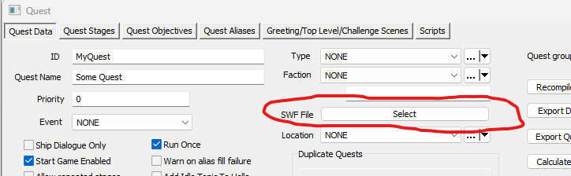

# Starfield UIPlayNice mod

Welcome to the **UIPlayNice** official github.

## What

[**UIPlayNice**](https://creations.bethesda.net/en/starfield/details/08f53db9-450d-4cf3-9e8e-5c4bc6970aa2/UIPlayNice) is a mod I created, and maintain, to help with the main issue Starfield has with UI mods.

## MODS
The following mods work with UIPlayNice:
- [Starfield Compendium](https://creations.bethesda.net/en/starfield/details/2fccc6a3-0368-4b40-bbd4-6a1551d44e41/Starfield_Compendium) (by Ideki)
- [Astrolabe](https://creations.bethesda.net/en/starfield/details/8c1a34fb-0ef4-4208-b3cb-a8f2493b1618/Astrolabe) (by Ideki)
- [Lock O'Plenty](https://creations.bethesda.net/en/starfield/details/664ebb36-0f13-4111-b941-1fb524ca25c0/Lock_O_Plenty) (by Ideki)
- [Watchtower](https://creations.bethesda.net/en/starfield) (by [Kinggath Creations](https://kinggathcreations.com/watchtower))

## Who

I am [Ideki](https://creations.bethesda.net/en/starfield/all?author_displayname=Ideki), author of the following mods for Starfield:
- [Starfield Compendium](https://creations.bethesda.net/en/starfield/details/2fccc6a3-0368-4b40-bbd4-6a1551d44e41/Starfield_Compendium)
- [Astrolabe](https://creations.bethesda.net/en/starfield/details/8c1a34fb-0ef4-4208-b3cb-a8f2493b1618/Astrolabe)
- [Lock O'Plenty](https://creations.bethesda.net/en/starfield/details/664ebb36-0f13-4111-b941-1fb524ca25c0/Lock_O_Plenty)

You can contact me on:
- Discord: **_zorglub**
- Reddit: **Zorglub01**

## Why

At the moment the game can only have 1 UI mod modify each of the game menus.

If multiple mods try to modify the same menu, only 1 of them will succeed, forcing players to choose which mod they can have instead of having them all.

I had some changes I wanted to do to some of my mods that would require them to work on the same menu.

After some investigation, I figured that the only way to do so what to create an in-between mod/framework that would handle my mods within the same menu, allowing them to co-exists.

After the initial proof of concept I decided to extend it to multiple menus and make it available to the community.

With **UIPlayNice** we (modders) can focus on making modifying and expanding the game interface without having to worry about modifying/maintaining the game menu UI themselves.

Players should not be forced to choose between mods simply because the game does not support having multiple mods modifying the same files.

The other goal is to remove the worry of modders to have to maintain their mods for each new version of the game.

**UIPlayNice** takes care of it so modders do not have to modify the game menus files.

## Tools

If you want make UI mods, you will need the following tools:

 - [FFDec](https://github.com/jindrapetrik/jpexs-decompiler): to decompile the game UI menus
 - [Adobe Animate](https://www.adobe.com/ca/products/animate.html): to be able to compile your UI.
 - [Starfield-Creators/Interface: The unofficial Starfield user interface development kit. (github.com)](https://github.com/Starfield-Creators/Interface) by Scrivener07: a very useful repository of all Starfield UI files.
 - Access to the Bethesda Creation Kit.

## How
I have modified each of the supported game Menu ([see list below](#Menus)) to have them load UIPlayNice internally.

**UIPlayNice** works by loading UI mods and sharing the events the game menu receives with each mod it handles for that menu.

It also expose the game menu to each UI mod so direct modifications can be done by the mods.

Each UI mod can also add buttons to the game menu buttons bar.

All of this is accomplish simply by implementing the [UIPlayNiceModInterface.as](Example/UIPlayNiceModInterface.as) in your actionscript UI.<br>
And using the CK to setup your mod to register with UIPlayNice for any menu you want (see [Tutorial](#tutorial) for details).

I am providing a [sample project](Example) for UI modders to try and start their own project.<br>
Just rename the as/fla files to your own project name. (Remember to change the class names in the fla too!).

## Support & Updates
UIplayNice works for PC and Xbox.

I have created a tool that allows me to automatically update **UIPlayNice** to the game menu files latest version in less than 2 minutes.<br>
So each time a new version of the game will be available, I will publish an updated version of the Menu files very quickly.<br>
All you have to do is:
- Get the latest version of the Menu files your mod is using from [Menu](Menus)
- Copy them them in **steamapps\common\Starfield\Data\interface**
- Repackage all your mods files in the CK, and publish it.

If you do not feel like updating your UIPlayNice menu files each time, you can recommend your players to install the UIPlayNice mod and make it top of the list.<br>
This way its files would overwrite yours and ensure that players always have the latest.

Do not make UIPlayNice a dependency of your mod.<br>
while UIPlayNice is achievement-friendly, as per Bethesda's rules paid mods cannot have dependencies.<br>
The UIPlayNice menu files you use **MUST** be archived with your mod files to skip this dependency rule.

## Important
The new version of UIPlayNice with Self-registration does not work **when the player is piloting a spaceship**.<br>
This is due to a limitation from the game itself.<br>
I have contacted the devs about it, but I do not know if/when they will 'fix' it.<br>
Yes, the issue does not affect my own mods because I have 'patched' UIPlayNice for them.<br>
If your mod is self-contained (meaning not receiving data from Papyrus, [contact me](#who) and I will see what I can do.<br>
If your mod received data/command from Papyrus, there is unfortunately nothing I can do because the game does not process the Papyrus event used for communication while the player is in space.<br>
I agree it is a weird issue, but there is nothing I can do to fix it as it would require a game change.

As a UI modder using UIPlayNice, remember that you are not the only mod the players are using.

So be mindful of other mods:

- If you modify existing UI elements of a menu, keep the existing path to instances (ex: A menu has element A with a child B, and you want to replace A with your own version.<br>
You should still provide a child B in your A in case another mod needs access to it.)

- Refer to the list below of [Menu-Mod-Buttons](#menu-mod-buttons) to see which mod adds which buttons to which menu.

## Menus
Below is the list of menus **UIPlayNice** supports for modding.
- ArmorCraftingMenu: UI attached to the Armor crafting bench
- ContainerMenu: UI Attached to containers
- DataMenu: UI with our character in the middle of a circle and subsection your can navigate to around it
- DrugCraftingMenu: UI attached to the Drug Crafting bench
- FoodCraftingMenu: UI attached to the Food crafting bench
- GalaxyStarmapMarkers: UI attached to the Planet/System/Galaxy map
- GalaxyStarmapMenu: UI attached to the Planet/System/Galaxy map
- IndustrialCraftingMenu: UI attached to the Components Crafting bench
- InventoryMenu: UI attached to the inventory
- MissionsMenu: UI attached to the list of missions
- ResearchMenu: UI Attached to the Research bench
- SecurityMenu: UI attached to the DigiPick minigame
- SkillsMenu: UI attached to the skills view
- SpaceshipEditorMenu: UI attached to editing a spaceship
- SpaceshipInfoMenu : UI attached to showing a spaceship info
- WeaponCraftingMenu: UI attached t othe Weapon Crafting bench

If you need **UIPlayNice** to support some menus that are not listed above, [contact me](#who) and I will see what can be done.

## Menu Mod Buttons
Below is the list of each menu with the mods and the buttons those mods are using (that I know of).<br>
If you want to add a button for your mod, [contact me](#who) and I can add your mod/button(s) to the list below.

Try to not conflict with them.

I know the number of buttons we can use it limited, but let's try our best to not step on each others feet.

- DataMenu
  - Starfield Compendium
	  - Select
- GalaxyStarmapMenu
  - Watchtower
	  - Pause

## Tutorial
If you are a UI modder interested in using **UIPlayNice**, there are 2 ways you can use it:
- Start from the example project I provided
- Implement the UIPlayNiceModInterface I created.
You can see how to implement it in the example I provided.

To start from the example I provided, you need to follow these steps to get it to work:
1. Using Archive2.exe (from the Bethesda Creation Kit), extract **Starfield - Interface.ba2** to a temporary folder.
2. Go to your temporary folder (Step #1) and use FFDec to open a menu. Ex: **datamenu.swf**.
3. In FFDec, click 'Export to FLA', Choose a folder where the fla and as3 files will be extracted.<br>
That folder will be your work folder, where you edit/compile your own fla.<br>
You need this step to make sure you have the files required to compile later on (Button factory, event manager,...).
4. Download the UIPlayNice-updated Menu files (ex: DataMenu.swf & DataMenu_lrg.swf) from [Menu](Menus).<br>
And place them in your **steamapps\common\Starfield\Data\interface**.
5. Download **UIPlayNice.swf** from [Menu](Menus).<br>
And place it in your **steamapps\common\Starfield\Data\interface**.
6. Download the [Papyrus script](Scripts/uiplaynice/myuiplaynicemanager.pex) and place it in **steamapps\common\Starfield\Data\Scripts\uiplaynice**
7. Download all files in [Example](Example) and save them in your work folder (where you extracted the files in step #3).
8. Go inside your work folder and open [UIPlayNiceExample.fla](Example/UIPlayNiceExample.fla) with **Adobe Animate**.
9. Publish **UIPlayNiceExample** to generate the swf file.
10. Copy the swf file to **steamapps\common\Starfield\Data\interface**
11. Open the Starfield: Creation Kit
12. Load your plugin in the CK (don't forget to mark it as **Active File**)
13. In the **Object Window**, navigate to the **Character** > **Quest** sub-category - and select it.
14. In the right-half of that window you should now see a bunch of quest records, right click anywhere on that half and select **New**.
15. Enter something unique for the ID field, I tend to make up a prefix and then name it what it is. For example, UIPN_RegistrationQuest.
16. Click OK to create the record, then save your plugin.
17. In the top-left of that object window is a Text Filter box, search up the ID you made up in step 15 to see your quest - double-click it.
18. You should now have a **scripts** tab, select it.
19. Click **Add**, and this will bring up a search menu, search up the **MyUIPlayNiceManager** file, select it, and click OK.
20. You will then be presented with the Properties menu. Here you will see MyUIMenus listed in red, double-click this.
21. On the right-side, click Add another box should pop-up.
22. Double click each property in turn and fill them out.<br>
There is a documentation string section to the bottom right of that window when you select one with hints on how to fill them out, you should be able to skip the TargetMenuName, since the TargetMenuID should have what you need listed in its documentation string.<br>
	- ArmorCraftingMenu = 0
	- BSMissionMenu = 1
	- ChargenMenu = 2
	- ContainerMenu = 3
	- DataMenu = 4
	- DrugsCraftingMenu = 5
	- FoodCraftingMenu = 6
	- GalaxyStarMapMenu = 7
	- HUDMessagesMenu = 8
	- IndustrialCraftingMenu = 9
	- InventoryMenu = 10
	- LoadingMenu = 11
	- MonocleMenu = 12
	- PauseMenu = 13
	- SecurityMenu = 14
	- ShipCrewMenu = 15
	- SkillsMenu = 16
	- SpaceshipEditorMenu = 17
	- SpaceshipHudMenu = 18
	- SpaceshipInfoMenu = 19
	- ResearchMenu = 20
	- WeaponsCraftingMenu = 21
	- WorkshopMenu = 22<br>
(Note: not all of those menus are supported by UIPlayNice yet)

23. After filling that out, click OK on everything that's open, and then save your plugin.
24. Create an archive containing:
     1. All files in **steamapps\common\Starfield\Data\interface** (ex: DataMenu.swf, DataMenu_lrg.swf, UIPlayNiceExample.swf, UIPlayNice.swf)
	 2. All files in **steamapps\common\Starfield\Data\Scripts\uiplaynice**
25. Start the game, make sure your mod is enabled in your mods list and open the menu you added **UIPlayNiceExample** to.<br>Ex: the view with our Character in the middle (DataMenu).
26. You should see some text in red in the top left corner and a dummy button in the bottom right buttons bar.

If some steps are not clear, or something does not work, [contact me](#who) and I will see what I can do to help/clarify.

## How to send data from Papyrus to your mod

The most advanced form of integration involves sending data with Papyrus.<br>
This tutorial will assume general knowledge of Papyrus and will speak in more broad terms.

In order to send data to your SWF files, you’ll need to register for and react to the corresponding base game menu opening.

You’ll want to create a quest with a management script on it to handle this.

Using the function RegisterForMenuOpenCloseEvent, you can register for the base game SWF yours works with opening and closing.<br>
You can do this in the OnQuestStarted event.<br>
For example:

```
Event OnQuestStarted()
	RegisterForMenuOpenCloseEvent(“GalaxyStarMapMenu”)
EndEvent
```

You’ll then want to set up a reaction to that event. For example:

```
Event OnMenuOpenCloseEvent(String asMenuName, Bool abOpening)
	if(asMenuName == “GalaxyStarMapMenu”)
		if(abOpening)
			SendMyMapData()
		Endif
	endif
EndEvent
```

Then finally you’ll want to send your actual data. UIPlayNice has a basic relay feature to send a string to your SWF file.<br>
There is a papyrus function called **Game.ShowCustomWatchAlert**, this function accepts a string and sends it to the watch hud.<br>
UIPlayNice can capture these strings and relay them for you.

It’s up to you to determine what data to send and how to react to it, but here is the format UIPlayNice is looking for:

```
"UIPlayNice.ForwardData." + sTargetMenu + “.” + sYourMenu + “:” + sCommandYourSWFWillReactTo
```

Where **sTargetMenu** is a string of the base game’s swf name without extension, and **sYourMenu** is a string of your swf name without extension.

Here’s an example command:

```
Game.ShowCustomWatchAlert(“UIPlayNice.ForwardData.GalaxyStarMapMenu.watchtowergalaxymap:WhateverDataIWantMyModToReactTo”)
```

In reality, that “WhateverDataIWantMyModToReactTo” would be a delimited string of the data you want your swf to be able to handle.

## How to set a custom icon for your mod quests?

The simplest integration you can do with UIPlayNice is a custom quest icon.<br>
To set this up do the following:

1. Follow all instructions from the ([Tutorial](#tutorial)) to create your mod
2. Download the following files:
	- [MissionMenu.swf](Menus/missionmenu.fla)
	- [MissionMenu_lrg.swf](Menus/missionmenu_lrg.fla)
	- [DataMenu.swf](Menus/datamenu.fla)
	- [DataMenu_lrg.swf](Menus/datamenu_lrg.fla)<br>
Note: **MissionMenu** will show your icon in the list of missions as well as the mission info panel.<br>
**DataMenu** will show your icon at the bottom of the central circle if your mission is the current active one.
3. Copy those 4 files to **Data\Interface**
4. Create a copy of the [UIPlayNiceExampleIcons.fla](Example/UIPlayNiceExampleIcons.fla) file.
5. Update the following 2 objects **only**:
	- Icon
	- Icon Color<br>
The other 2 objects will automatically update.<br>
Note:
	- the icons size **must** be 32x32 pixels at most
	- the icons	must be centered at 0,0 (**not** 0,0 in the top left corner)
6. Publish the file to a swf and save it to your Starfield folder under **Data\Interface\questicons** (you will need to create the questicons folder).
7. Open your plugin in the Creation Kit, then for each quest you want to use the custom icon, click Select next to the SWF File option and navigate to your custom icon swf (in **Data\Interface\questicons**).


That’s it! As long as you have the base UIPlayNice files included, it will detect the icons and display them to the game Missions menu.

Note that as of the writing of this tutorial, the icons will not display in the objective update notifications in the top left corner due to limitations of the tools available to the community.<br>
This will likely be resolved in a future update of the game and UIPlayNice.

Keep an eye on the Github page for updates which will require you to update your mod’s copy of UIPlayNice.

## Others

The [source psc](Scripts/uiplaynice/myuiplaynicemanager.psc) file for the myuiplaynicemanager script is available if you ever want to tinker with it.
Just be mindful of the impact your changes may have on other mods that use the myuiplaynicemanager.pex.